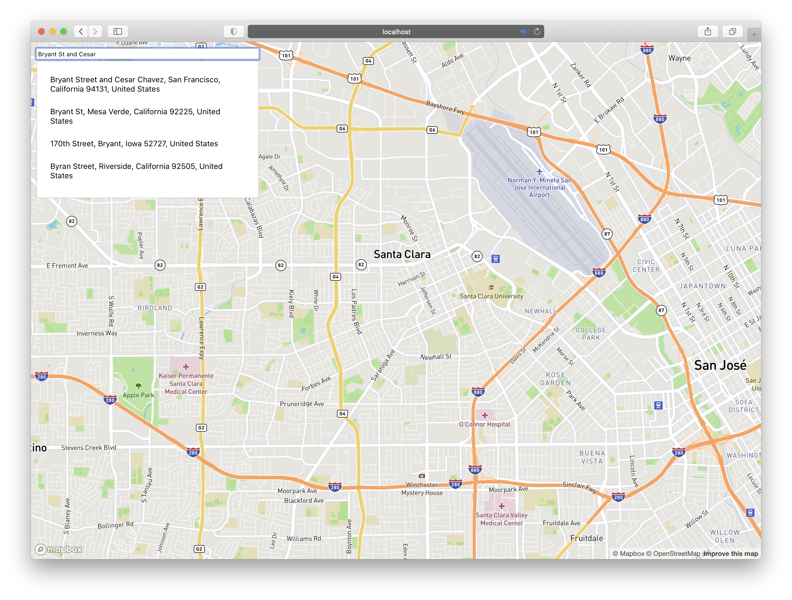
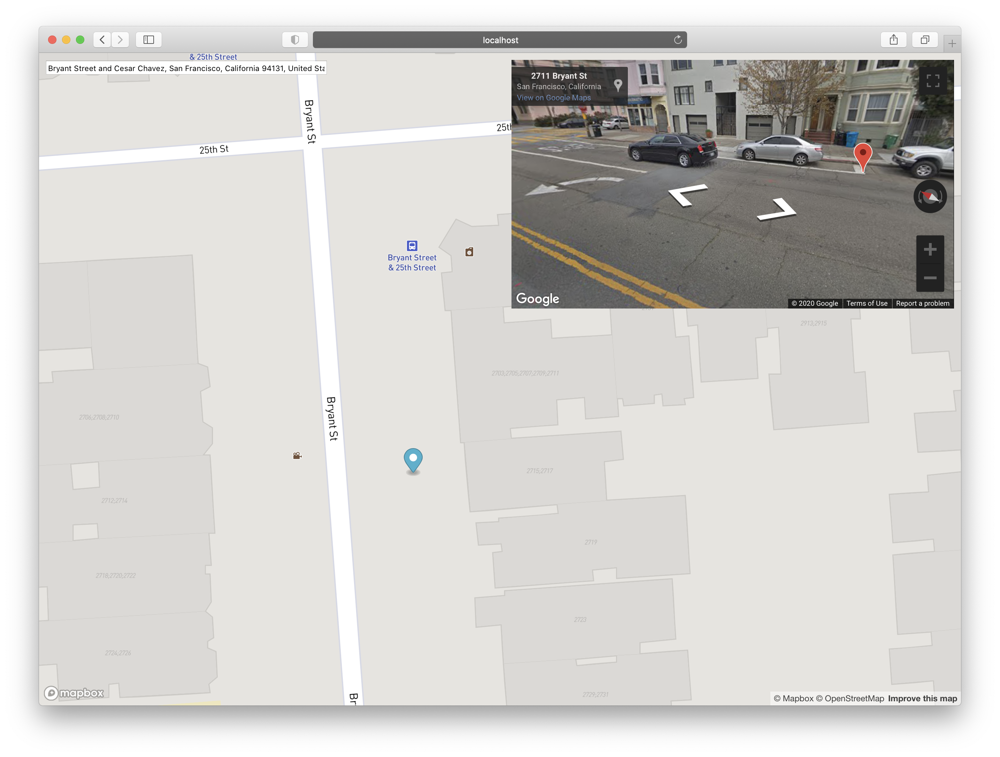
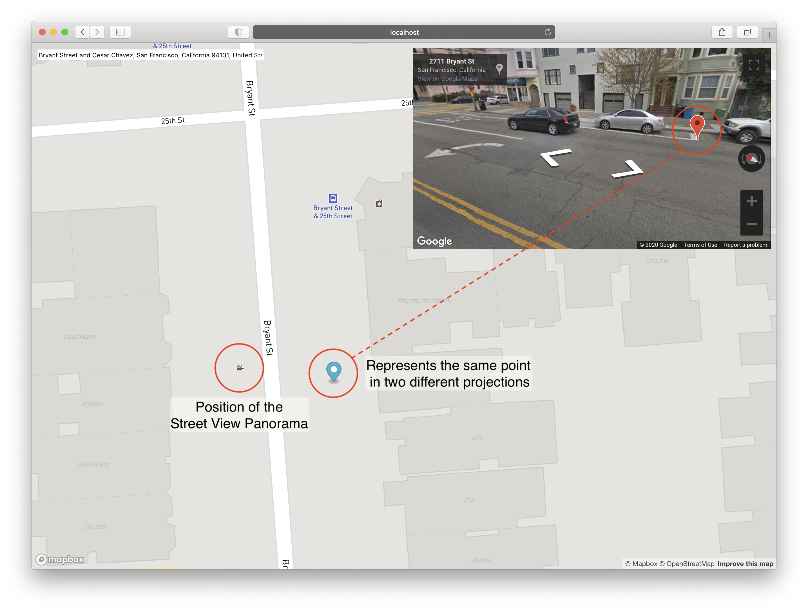

# React MapBox Google Street View App

This is a starter app for using MapBox GL v2+ and Google Maps JavaScript SDK with React 17+ (making use of functional 
components, context and hooks).






Press **S** key and click a location on the map to add a movable marker. 
Google Maps Street View Panorama for the same location opens up in top right.



One useful application of this tool is to accurate measure a point using combination of map and street view.
For example: in the image above, one can measure the start location of the bus stop by moving the marker on the map,
until it aligns with the markings on the street as visible in street view.

You will need [MapBox Access Token](https://docs.mapbox.com/help/how-mapbox-works/access-tokens/)
and [Google Maps API Key](https://developers.google.com/maps/documentation/javascript/get-api-key?utm_source=google&utm_medium=cpc&utm_campaign=FY20-Q3-global-demandgen-displayonnetworkhouseads-cs-GMP_maps_contactsal_saf_v2&utm_content=text-ad-none-none-DEV_c-CRE_460848633529-ADGP_Hybrid%20%7C%20AW%20SEM%20%7C%20BKWS%20~%20Google%20Maps%20API%20Key-KWID_43700035216023629-kwd-298247230705-userloc_9032188&utm_term=KW_google%20maps%20api%20key-ST_google%20maps%20api%20key&gclid=Cj0KCQiA5vb-BRCRARIsAJBKc6IooF5xEGHa0sj_c4Ck1RQQxYBnDr6ebIwlhcyeYo587f6DX-ml2-0aAv-eEALw_wcB)
 for using this app.

Add your MapBox token and Google Maps API key to file `src/credentials.js` as shown below.

```javascript
const CREDENTIALS = {
    MAPBOX_ACCESS_TOKEN: "place-your-access-token-here",
    GOOGLE_MAPS_API_KEY: "place-your-api-key-here",
}

export default CREDENTIALS;
```

### Third party React components used

#### MapBox Auto-complete Search Bar

```shell script
npm install react-mapbox-autocomplete --save
```
[Link to npm](https://www.npmjs.com/package/react-mapbox-autocomplete) | 
[Link to github](https://github.com/localvore-today/react-mapbox-autocomplete#readme)

#### React Streetview

This component was extended to support dynamic position updates and markers.

```shell script
npm install react-streetview --save
```

[Link to npm](https://www.npmjs.com/package/react-streetview) | 
[Link to github](https://github.com/elcsiga/react-streetview)


This project was bootstrapped with [Create React App](https://github.com/facebook/create-react-app).

## Available Scripts

In the project directory, you can run:

### `npm start`

Runs the app in the development mode.\
Open [http://localhost:3000](http://localhost:3000) to view it in the browser.

The page will reload if you make edits.\
You will also see any lint errors in the console.

### `npm run build`

Builds the app for production to the `build` folder.\
It correctly bundles React in production mode and optimizes the build for the best performance.

The build is minified and the filenames include the hashes.\
Your app is ready to be deployed!

See the section about [deployment](https://facebook.github.io/create-react-app/docs/deployment) for more information.
